# Admin & Organization Workflows - First Responder Connect

Admin moderation workflows and organization/agency management processes.

**Last Updated:** January 24, 2026  
**Version:** 1.0

---

## Table of Contents

1. [Admin Workflows](#admin-workflows)
2. [Content Moderation](#content-moderation)
3. [User Management](#user-management)
4. [Organization Workflows](#organization-workflows)
5. [Subscription Management](#subscription-management)
6. [Analytics & Reporting](#analytics--reporting)

---

## Admin Workflows

### 1.1 Admin Dashboard Access Flow

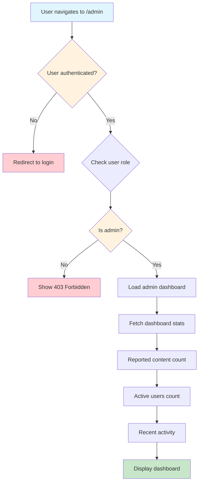

**Admin Check Implementation:**
```typescript
// middleware/adminCheck.ts
export async function checkAdminAccess(userId: string): Promise<boolean> {
  const { data: profile } = await supabase
    .from('profiles')
    .select('role')
    .eq('id', userId)
    .single();
    
  return profile?.role === 'admin';
}

// Component usage
function AdminDashboard() {
  const { user } = useAuth();
  const [isAdmin, setIsAdmin] = useState(false);
  const [loading, setLoading] = useState(true);
  
  useEffect(() => {
    checkAdminAccess(user.id).then(result => {
      setIsAdmin(result);
      setLoading(false);
    });
  }, [user]);
  
  if (loading) return <LoadingSpinner />;
  if (!isAdmin) return <Navigate to="/feed" />;
  
  return <AdminDashboardContent />;
}
```

---

## Content Moderation

### 2.1 Report Content Flow

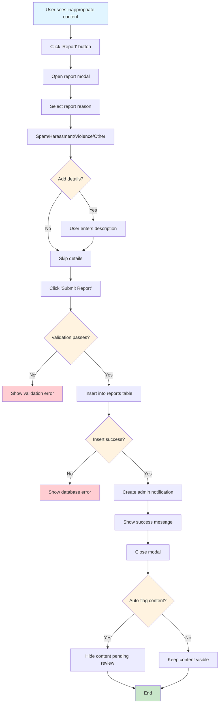

**Report Schema:**
```sql
CREATE TABLE reports (
  id UUID PRIMARY KEY DEFAULT uuid_generate_v4(),
  reporter_id UUID REFERENCES profiles(id),
  content_type TEXT CHECK (content_type IN ('post', 'comment', 'user', 'message')),
  content_id UUID NOT NULL,
  reason TEXT CHECK (reason IN ('spam', 'harassment', 'violence', 'inappropriate', 'other')),
  description TEXT,
  status TEXT DEFAULT 'pending' CHECK (status IN ('pending', 'reviewing', 'resolved', 'dismissed')),
  reviewed_by UUID REFERENCES profiles(id),
  reviewed_at TIMESTAMPTZ,
  resolution_notes TEXT,
  created_at TIMESTAMPTZ DEFAULT NOW()
);

-- Index for admin queries
CREATE INDEX idx_reports_status ON reports(status);
CREATE INDEX idx_reports_created ON reports(created_at DESC);
```

---

### 2.2 Review Reported Content Flow

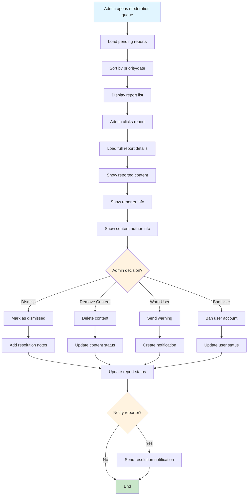

**Moderation Actions:**
```typescript
// lib/moderationService.ts
export async function moderateContent(
  reportId: string,
  action: 'dismiss' | 'remove' | 'warn' | 'ban',
  notes: string,
  adminId: string
) {
  const { data: report } = await supabase
    .from('reports')
    .select('*')
    .eq('id', reportId)
    .single();
    
  switch (action) {
    case 'dismiss':
      await supabase
        .from('reports')
        .update({
          status: 'dismissed',
          reviewed_by: adminId,
          reviewed_at: new Date().toISOString(),
          resolution_notes: notes
        })
        .eq('id', reportId);
      break;
      
    case 'remove':
      // Delete the content
      await supabase
        .from(report.content_type + 's')
        .delete()
        .eq('id', report.content_id);
        
      // Update report
      await supabase
        .from('reports')
        .update({
          status: 'resolved',
          reviewed_by: adminId,
          reviewed_at: new Date().toISOString(),
          resolution_notes: notes
        })
        .eq('id', reportId);
      break;
      
    case 'warn':
      // Send warning notification
      await supabase
        .from('notifications')
        .insert({
          user_id: report.content_author_id,
          type: 'warning',
          title: 'Content Warning',
          message: notes
        });
        
      // Update report
      await supabase
        .from('reports')
        .update({
          status: 'resolved',
          reviewed_by: adminId,
          reviewed_at: new Date().toISOString(),
          resolution_notes: notes
        })
        .eq('id', reportId);
      break;
      
    case 'ban':
      // Ban user
      await supabase
        .from('profiles')
        .update({
          status: 'banned',
          banned_at: new Date().toISOString(),
          ban_reason: notes
        })
        .eq('id', report.content_author_id);
        
      // Update report
      await supabase
        .from('reports')
        .update({
          status: 'resolved',
          reviewed_by: adminId,
          reviewed_at: new Date().toISOString(),
          resolution_notes: notes
        })
        .eq('id', reportId);
      break;
  }
}
```

---

### 2.3 Auto-Moderation Flow

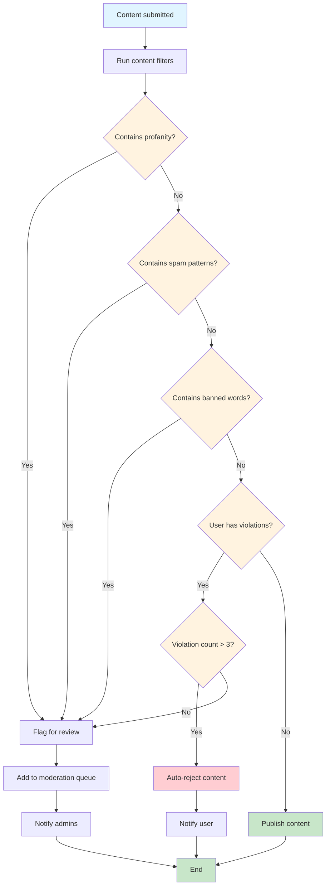

**Content Filter Implementation:**
```typescript
// lib/contentFilter.ts
const PROFANITY_LIST = ['word1', 'word2', /* ... */];
const SPAM_PATTERNS = [
  /buy now/gi,
  /click here/gi,
  /limited time/gi,
  /* ... */
];

export function checkContent(content: string): {
  safe: boolean;
  flags: string[];
} {
  const flags: string[] = [];
  
  // Check profanity
  const lowerContent = content.toLowerCase();
  for (const word of PROFANITY_LIST) {
    if (lowerContent.includes(word)) {
      flags.push('profanity');
      break;
    }
  }
  
  // Check spam patterns
  for (const pattern of SPAM_PATTERNS) {
    if (pattern.test(content)) {
      flags.push('spam');
      break;
    }
  }
  
  // Check excessive caps
  const capsRatio = (content.match(/[A-Z]/g) || []).length / content.length;
  if (capsRatio > 0.5 && content.length > 20) {
    flags.push('excessive_caps');
  }
  
  // Check excessive links
  const linkCount = (content.match(/https?:\/\//g) || []).length;
  if (linkCount > 3) {
    flags.push('excessive_links');
  }
  
  return {
    safe: flags.length === 0,
    flags
  };
}
```

---

## User Management

### 3.1 User Search & Management Flow

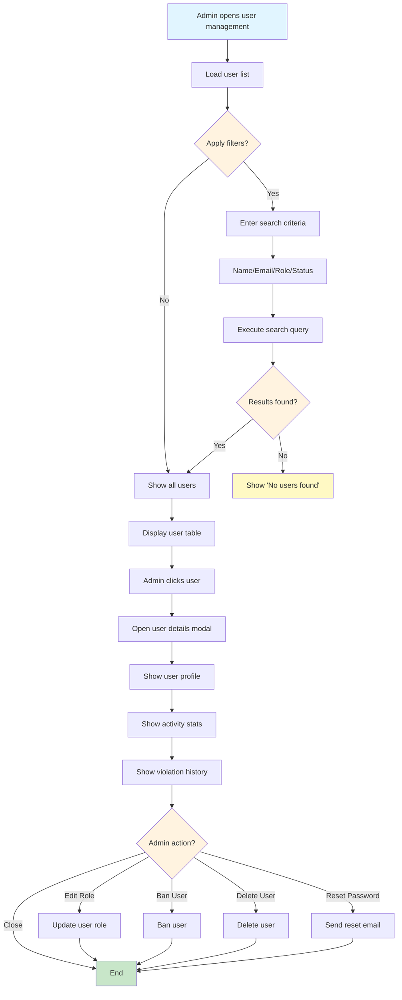

**User Management Query:**
```typescript
// Admin user search
async function searchUsers(filters: UserFilters) {
  let query = supabase
    .from('profiles')
    .select(`
      *,
      posts:posts(count),
      connections:connections(count),
      reports:reports(count)
    `)
    .order('created_at', { ascending: false });
    
  if (filters.search) {
    query = query.or(`
      full_name.ilike.%${filters.search}%,
      email.ilike.%${filters.search}%
    `);
  }
  
  if (filters.role) {
    query = query.eq('role', filters.role);
  }
  
  if (filters.status) {
    query = query.eq('status', filters.status);
  }
  
  const { data: users } = await query;
  return users;
}
```

---

## Organization Workflows

### 4.1 Create Organization Flow

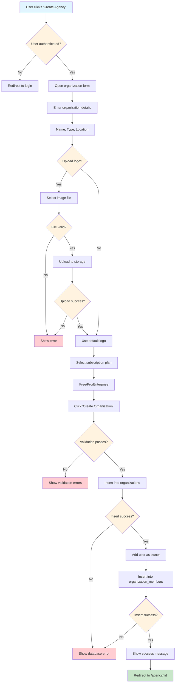

**Organization Schema:**
```sql
CREATE TABLE organizations (
  id UUID PRIMARY KEY DEFAULT uuid_generate_v4(),
  name TEXT NOT NULL,
  slug TEXT UNIQUE NOT NULL,
  type TEXT CHECK (type IN ('fire', 'ems', 'police', 'dispatch', 'other')),
  location TEXT,
  logo_url TEXT,
  description TEXT,
  website TEXT,
  phone TEXT,
  email TEXT,
  subscription_plan TEXT DEFAULT 'free' CHECK (subscription_plan IN ('free', 'pro', 'enterprise')),
  subscription_status TEXT DEFAULT 'active',
  member_limit INTEGER DEFAULT 10,
  created_at TIMESTAMPTZ DEFAULT NOW(),
  updated_at TIMESTAMPTZ DEFAULT NOW()
);

CREATE TABLE organization_members (
  id UUID PRIMARY KEY DEFAULT uuid_generate_v4(),
  organization_id UUID REFERENCES organizations(id) ON DELETE CASCADE,
  user_id UUID REFERENCES profiles(id) ON DELETE CASCADE,
  role TEXT DEFAULT 'member' CHECK (role IN ('owner', 'admin', 'member', 'viewer')),
  joined_at TIMESTAMPTZ DEFAULT NOW(),
  UNIQUE(organization_id, user_id)
);
```

---

### 4.2 Invite Member to Organization Flow

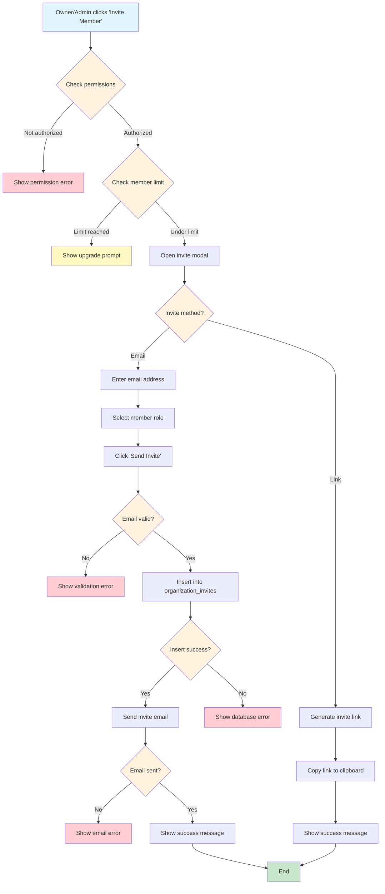

**Invite Implementation:**
```typescript
// lib/organizationService.ts
export async function inviteMember(
  organizationId: string,
  email: string,
  role: 'admin' | 'member' | 'viewer',
  invitedBy: string
) {
  // 1. Check if user already exists
  const { data: existingUser } = await supabase
    .from('profiles')
    .select('id')
    .eq('email', email)
    .single();
    
  // 2. Create invite
  const { data: invite, error } = await supabase
    .from('organization_invites')
    .insert({
      organization_id: organizationId,
      email: email,
      role: role,
      invited_by: invitedBy,
      token: generateInviteToken(),
      expires_at: new Date(Date.now() + 7 * 24 * 60 * 60 * 1000) // 7 days
    })
    .select()
    .single();
    
  if (error) throw error;
  
  // 3. Send email
  await sendInviteEmail({
    to: email,
    organizationName: organization.name,
    inviterName: inviter.full_name,
    inviteLink: `${APP_URL}/invite/${invite.token}`,
    role: role
  });
  
  return invite;
}
```

---

### 4.3 Accept Organization Invite Flow

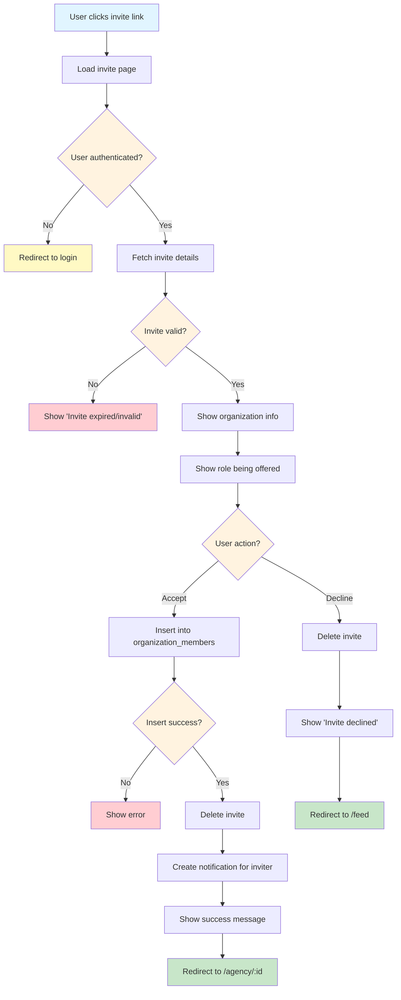

---

### 4.4 Manage Organization Members Flow

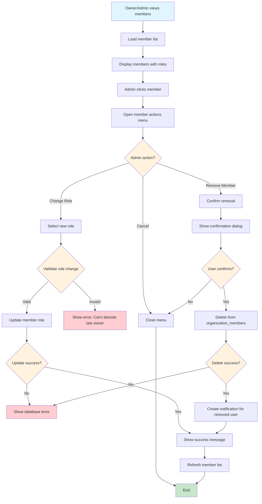

**Role Validation:**
```typescript
// Prevent removing last owner
async function canRemoveMember(
  organizationId: string,
  memberId: string
): Promise<boolean> {
  const { data: member } = await supabase
    .from('organization_members')
    .select('role')
    .eq('id', memberId)
    .single();
    
  if (member.role === 'owner') {
    // Check if there are other owners
    const { count } = await supabase
      .from('organization_members')
      .select('*', { count: 'exact', head: true })
      .eq('organization_id', organizationId)
      .eq('role', 'owner');
      
    return count > 1;
  }
  
  return true;
}
```

---

## Subscription Management

### 5.1 Upgrade Subscription Flow

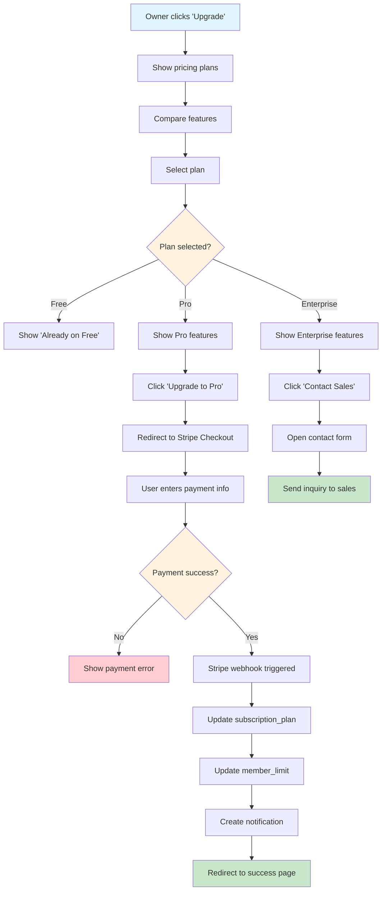

**Stripe Integration:**
```typescript
// lib/stripeService.ts
export async function createCheckoutSession(
  organizationId: string,
  plan: 'pro' | 'enterprise'
) {
  const priceIds = {
    pro: process.env.STRIPE_PRO_PRICE_ID,
    enterprise: process.env.STRIPE_ENTERPRISE_PRICE_ID
  };
  
  const session = await stripe.checkout.sessions.create({
    mode: 'subscription',
    payment_method_types: ['card'],
    line_items: [{
      price: priceIds[plan],
      quantity: 1
    }],
    success_url: `${APP_URL}/agency/${organizationId}?success=true`,
    cancel_url: `${APP_URL}/agency/${organizationId}/billing`,
    metadata: {
      organization_id: organizationId,
      plan: plan
    }
  });
  
  return session.url;
}

// Webhook handler
export async function handleStripeWebhook(event: Stripe.Event) {
  switch (event.type) {
    case 'checkout.session.completed':
      const session = event.data.object as Stripe.Checkout.Session;
      await supabase
        .from('organizations')
        .update({
          subscription_plan: session.metadata.plan,
          subscription_status: 'active',
          member_limit: session.metadata.plan === 'pro' ? 50 : 999
        })
        .eq('id', session.metadata.organization_id);
      break;
      
    case 'customer.subscription.deleted':
      // Downgrade to free
      const subscription = event.data.object as Stripe.Subscription;
      await supabase
        .from('organizations')
        .update({
          subscription_plan: 'free',
          subscription_status: 'canceled',
          member_limit: 10
        })
        .eq('stripe_subscription_id', subscription.id);
      break;
  }
}
```

---

## Analytics & Reporting

### 6.1 Admin Analytics Dashboard Flow

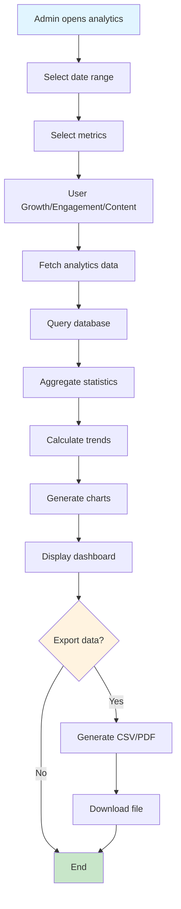

**Analytics Queries:**
```typescript
// Get user growth stats
async function getUserGrowthStats(startDate: Date, endDate: Date) {
  const { data } = await supabase
    .from('profiles')
    .select('created_at')
    .gte('created_at', startDate.toISOString())
    .lte('created_at', endDate.toISOString());
    
  // Group by day
  const dailySignups = data.reduce((acc, profile) => {
    const date = new Date(profile.created_at).toDateString();
    acc[date] = (acc[date] || 0) + 1;
    return acc;
  }, {});
  
  return dailySignups;
}

// Get engagement stats
async function getEngagementStats() {
  const { data: posts } = await supabase
    .from('posts')
    .select('created_at')
    .gte('created_at', new Date(Date.now() - 30 * 24 * 60 * 60 * 1000).toISOString());
    
  const { data: comments } = await supabase
    .from('post_comments')
    .select('created_at')
    .gte('created_at', new Date(Date.now() - 30 * 24 * 60 * 60 * 1000).toISOString());
    
  return {
    totalPosts: posts.length,
    totalComments: comments.length,
    avgPostsPerDay: posts.length / 30,
    avgCommentsPerDay: comments.length / 30
  };
}
```

---

## Summary

This admin and organization workflow documentation covers:

✅ **Admin Access** - Dashboard access control  
✅ **Content Moderation** - Report handling, review process, auto-moderation  
✅ **User Management** - Search, edit, ban, delete users  
✅ **Organizations** - Create, invite, manage members  
✅ **Subscriptions** - Upgrade, payment, webhooks  
✅ **Analytics** - Dashboard stats, reporting

**Related Documentation:**
- [Workflows](./WORKFLOWS.md) - User-facing workflows
- [Technical Workflows](./TECHNICAL_WORKFLOWS.md) - Technical processes
- [Architecture](./ARCHITECTURE.md) - System architecture
