# Technical Workflows - First Responder Connect

Technical process flows, data flows, and system architecture workflows.

**Last Updated:** January 24, 2026  
**Version:** 1.0

---

## Table of Contents

1. [Authentication & Session Management](#authentication--session-management)
2. [Data Flow Patterns](#data-flow-patterns)
3. [API Request Lifecycle](#api-request-lifecycle)
4. [Real-time Communication](#real-time-communication)
5. [File Upload & Storage](#file-upload--storage)
6. [State Management](#state-management)
7. [Error Handling](#error-handling)
8. [Performance Optimization](#performance-optimization)

---

## Authentication & Session Management

### 1.1 Complete Authentication Flow

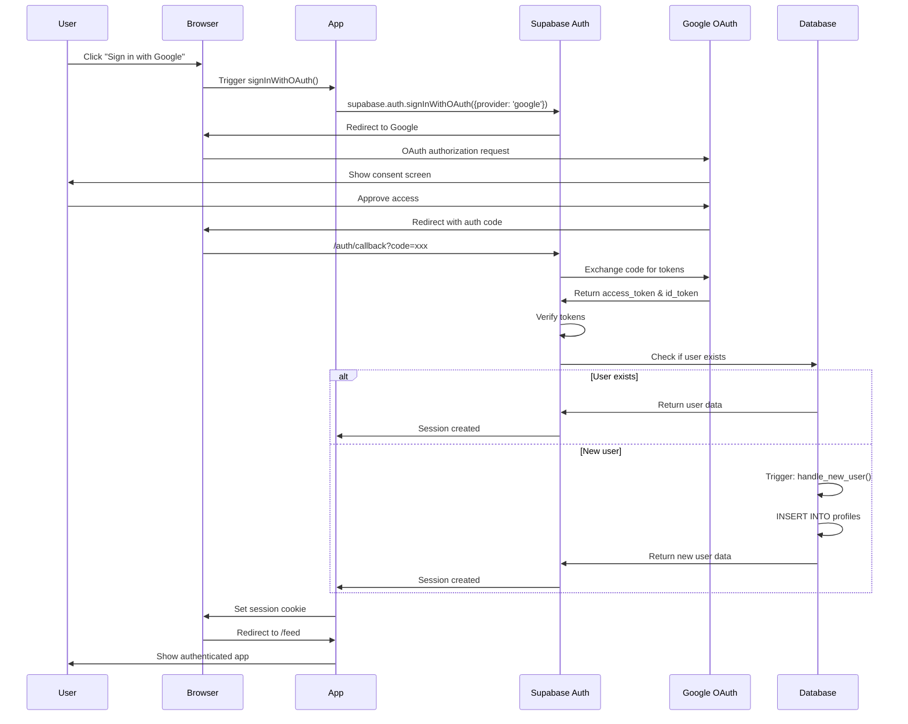

**Key Components:**

1. **OAuth Flow**
   - Provider: Google OAuth 2.0
   - Scopes: `email`, `profile`
   - Redirect URI: `{SUPABASE_URL}/auth/v1/callback`

2. **Session Management**
   - Storage: HTTP-only cookies
   - Duration: 7 days (configurable)
   - Refresh: Automatic token refresh

3. **Database Trigger**
```sql
CREATE OR REPLACE FUNCTION handle_new_user()
RETURNS TRIGGER AS $$
BEGIN
  INSERT INTO public.profiles (id, email, full_name, avatar_url)
  VALUES (
    NEW.id,
    NEW.email,
    NEW.raw_user_meta_data->>'full_name',
    NEW.raw_user_meta_data->>'avatar_url'
  );
  RETURN NEW;
END;
$$ LANGUAGE plpgsql SECURITY DEFINER;

CREATE TRIGGER on_auth_user_created
  AFTER INSERT ON auth.users
  FOR EACH ROW EXECUTE FUNCTION handle_new_user();
```

---

### 1.2 Session Refresh Flow

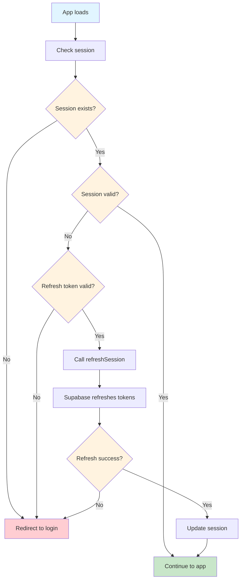

**Implementation:**
```typescript
// AuthContext.tsx
useEffect(() => {
  // Get initial session
  supabase.auth.getSession().then(({ data: { session } }) => {
    setSession(session);
    setUser(session?.user ?? null);
  });

  // Listen for auth changes
  const { data: { subscription } } = supabase.auth.onAuthStateChange(
    async (event, session) => {
      setSession(session);
      setUser(session?.user ?? null);
      
      if (event === 'SIGNED_OUT') {
        navigate('/');
      }
      
      if (event === 'TOKEN_REFRESHED') {
        console.log('Token refreshed successfully');
      }
    }
  );

  return () => subscription.unsubscribe();
}, []);
```

---

### 1.3 Row Level Security (RLS) Flow

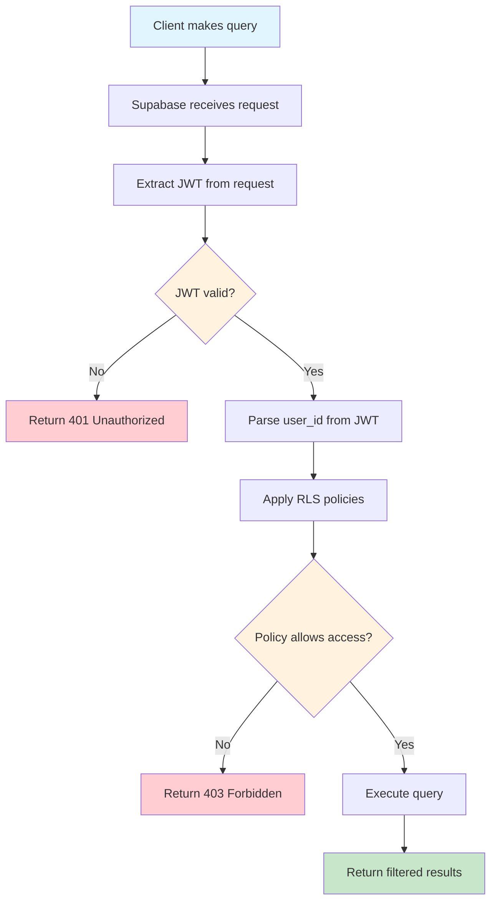

**Example RLS Policies:**
```sql
-- Users can only read their own profile
CREATE POLICY "Users can view own profile"
ON profiles FOR SELECT
USING (auth.uid() = id);

-- Users can only update their own profile
CREATE POLICY "Users can update own profile"
ON profiles FOR UPDATE
USING (auth.uid() = id);

-- Users can view posts from anyone
CREATE POLICY "Anyone can view posts"
ON posts FOR SELECT
USING (true);

-- Users can only create posts as themselves
CREATE POLICY "Users can create own posts"
ON posts FOR INSERT
WITH CHECK (auth.uid() = user_id);

-- Users can only delete their own posts
CREATE POLICY "Users can delete own posts"
ON posts FOR DELETE
USING (auth.uid() = user_id);
```

---

## Data Flow Patterns

### 2.1 React Query Data Flow

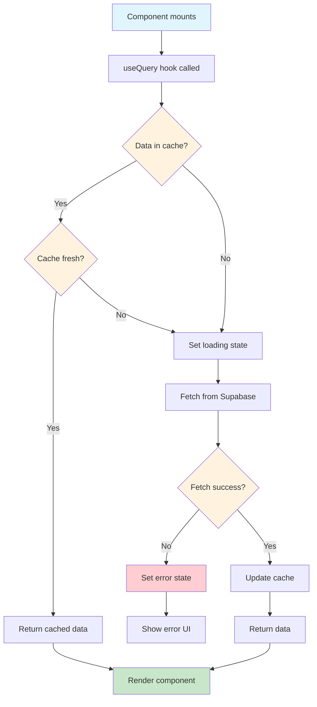

**Implementation:**
```typescript
// hooks/usePosts.ts
export function usePosts() {
  return useQuery({
    queryKey: ['posts'],
    queryFn: async () => {
      const { data, error } = await supabase
        .from('posts')
        .select(`
          *,
          user:profiles(id, full_name, avatar_url),
          likes:post_likes(count),
          comments:post_comments(count)
        `)
        .order('created_at', { ascending: false })
        .limit(20);
        
      if (error) throw error;
      return data;
    },
    staleTime: 1000 * 60 * 5, // 5 minutes
    cacheTime: 1000 * 60 * 30, // 30 minutes
  });
}

// Component usage
function Feed() {
  const { data: posts, isLoading, error } = usePosts();
  
  if (isLoading) return <LoadingSpinner />;
  if (error) return <ErrorMessage error={error} />;
  
  return <PostList posts={posts} />;
}
```

---

### 2.2 Mutation Flow with Optimistic Updates

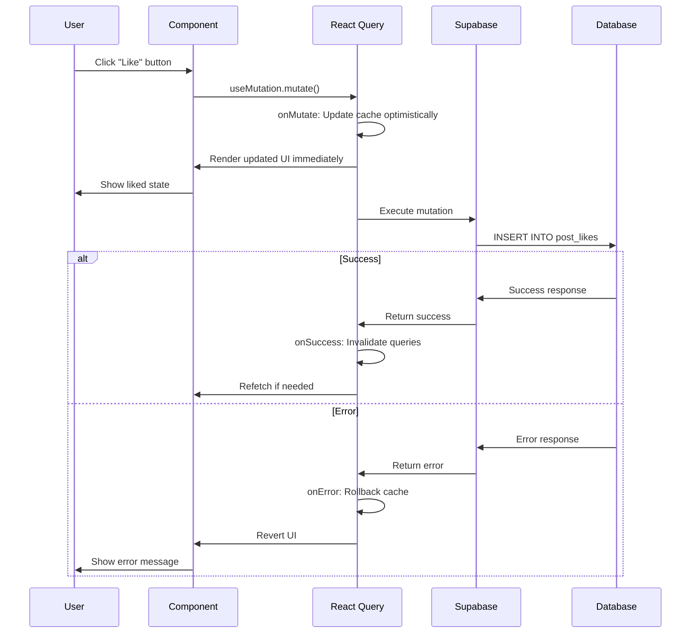

**Implementation:**
```typescript
// hooks/useToggleLike.ts
export function useToggleLike() {
  const queryClient = useQueryClient();
  
  return useMutation({
    mutationFn: async ({ postId, isLiked }: ToggleLikeParams) => {
      if (isLiked) {
        return supabase
          .from('post_likes')
          .delete()
          .match({ post_id: postId, user_id: currentUser.id });
      } else {
        return supabase
          .from('post_likes')
          .insert({ post_id: postId, user_id: currentUser.id });
      }
    },
    
    // Optimistic update
    onMutate: async ({ postId, isLiked }) => {
      // Cancel outgoing refetches
      await queryClient.cancelQueries({ queryKey: ['posts'] });
      
      // Snapshot previous value
      const previousPosts = queryClient.getQueryData(['posts']);
      
      // Optimistically update cache
      queryClient.setQueryData(['posts'], (old: Post[]) => {
        return old.map(post => {
          if (post.id === postId) {
            return {
              ...post,
              likes: isLiked ? post.likes - 1 : post.likes + 1,
              isLiked: !isLiked
            };
          }
          return post;
        });
      });
      
      return { previousPosts };
    },
    
    // Rollback on error
    onError: (err, variables, context) => {
      queryClient.setQueryData(['posts'], context.previousPosts);
      toast.error('Failed to update like');
    },
    
    // Refetch on success
    onSuccess: () => {
      queryClient.invalidateQueries({ queryKey: ['posts'] });
    }
  });
}
```

---

## API Request Lifecycle

### 3.1 Complete Request Flow

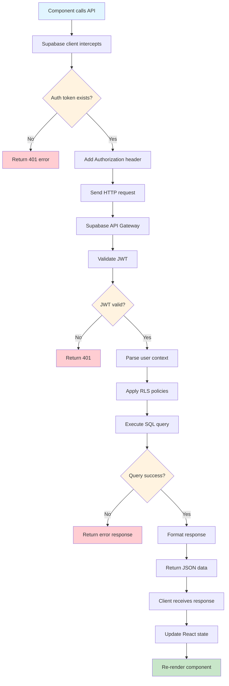

---

### 3.2 Error Handling Flow

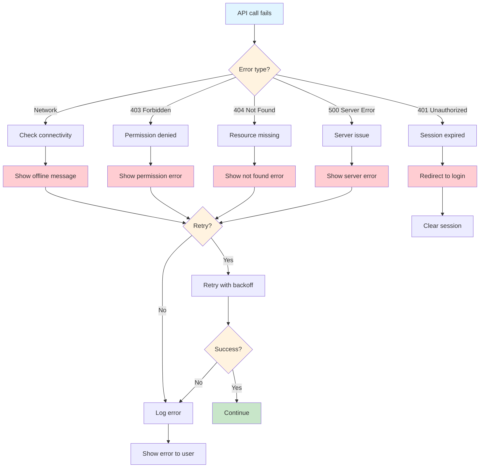

**Error Handler Implementation:**
```typescript
// lib/errorHandler.ts
export function handleSupabaseError(error: PostgrestError) {
  // Log to monitoring service
  console.error('Supabase error:', error);
  
  // Map error codes to user-friendly messages
  const errorMessages: Record<string, string> = {
    '23505': 'This item already exists',
    '23503': 'Referenced item not found',
    '42501': 'You do not have permission to perform this action',
    'PGRST116': 'No rows found',
  };
  
  const message = errorMessages[error.code] || 'An unexpected error occurred';
  
  // Show toast notification
  toast.error(message);
  
  // Return structured error
  return {
    code: error.code,
    message,
    details: error.details,
    hint: error.hint,
  };
}

// Usage in component
try {
  const { data, error } = await supabase
    .from('posts')
    .insert(newPost);
    
  if (error) throw error;
  
  return data;
} catch (error) {
  handleSupabaseError(error);
}
```

---

## Real-time Communication

### 4.1 Realtime Subscription Flow

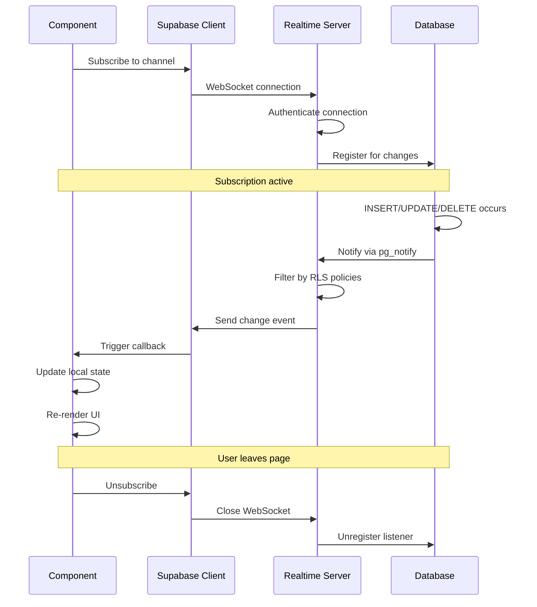

**Implementation:**
```typescript
// hooks/useRealtimePosts.ts
export function useRealtimePosts() {
  const queryClient = useQueryClient();
  
  useEffect(() => {
    // Subscribe to new posts
    const subscription = supabase
      .channel('public:posts')
      .on('postgres_changes', {
        event: 'INSERT',
        schema: 'public',
        table: 'posts'
      }, (payload) => {
        // Add new post to cache
        queryClient.setQueryData(['posts'], (old: Post[]) => {
          return [payload.new as Post, ...old];
        });
      })
      .on('postgres_changes', {
        event: 'DELETE',
        schema: 'public',
        table: 'posts'
      }, (payload) => {
        // Remove deleted post from cache
        queryClient.setQueryData(['posts'], (old: Post[]) => {
          return old.filter(post => post.id !== payload.old.id);
        });
      })
      .subscribe();
    
    return () => {
      subscription.unsubscribe();
    };
  }, [queryClient]);
}
```

---

### 4.2 Message Delivery Flow

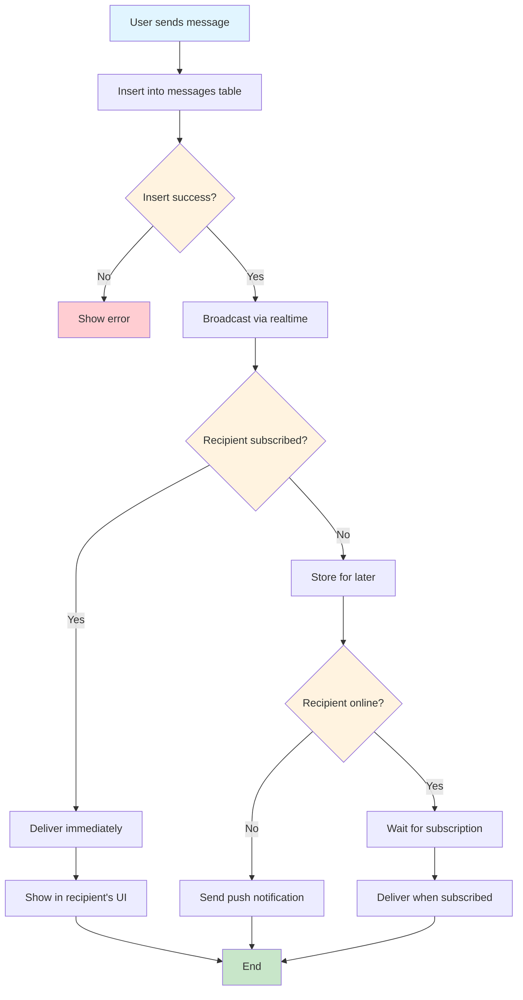

---

## File Upload & Storage

### 5.1 Image Upload Flow

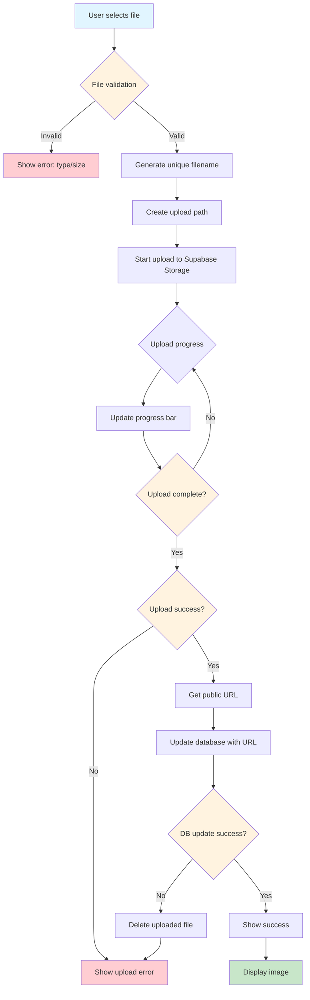

**Implementation:**
```typescript
// lib/uploadImage.ts
export async function uploadImage(
  file: File,
  bucket: string,
  folder: string
): Promise<string> {
  // 1. Validate file
  const maxSize = 10 * 1024 * 1024; // 10MB
  const allowedTypes = ['image/jpeg', 'image/png', 'image/webp'];
  
  if (file.size > maxSize) {
    throw new Error('File size must be less than 10MB');
  }
  
  if (!allowedTypes.includes(file.type)) {
    throw new Error('File must be an image (JPEG, PNG, or WebP)');
  }
  
  // 2. Generate unique filename
  const fileExt = file.name.split('.').pop();
  const fileName = `${Math.random().toString(36).substring(2)}.${fileExt}`;
  const filePath = `${folder}/${fileName}`;
  
  // 3. Upload to storage
  const { data, error } = await supabase.storage
    .from(bucket)
    .upload(filePath, file, {
      cacheControl: '3600',
      upsert: false
    });
    
  if (error) throw error;
  
  // 4. Get public URL
  const { data: { publicUrl } } = supabase.storage
    .from(bucket)
    .getPublicUrl(filePath);
    
  return publicUrl;
}

// Usage in component
async function handleImageUpload(file: File) {
  try {
    setUploading(true);
    
    const imageUrl = await uploadImage(file, 'post-images', userId);
    
    // Update post with image URL
    await supabase
      .from('posts')
      .update({ image_url: imageUrl })
      .eq('id', postId);
      
    toast.success('Image uploaded successfully');
  } catch (error) {
    toast.error(error.message);
  } finally {
    setUploading(false);
  }
}
```

---

### 5.2 Storage RLS Policies

```sql
-- Allow users to upload to their own folder
CREATE POLICY "Users can upload own files"
ON storage.objects FOR INSERT
WITH CHECK (
  bucket_id = 'profile-media' AND
  (storage.foldername(name))[1] = auth.uid()::text
);

-- Allow users to read their own files
CREATE POLICY "Users can read own files"
ON storage.objects FOR SELECT
USING (
  bucket_id = 'profile-media' AND
  (storage.foldername(name))[1] = auth.uid()::text
);

-- Allow users to delete their own files
CREATE POLICY "Users can delete own files"
ON storage.objects FOR DELETE
USING (
  bucket_id = 'profile-media' AND
  (storage.foldername(name))[1] = auth.uid()::text
);

-- Allow public read access to post images
CREATE POLICY "Anyone can view post images"
ON storage.objects FOR SELECT
USING (bucket_id = 'post-images');
```

---

## State Management

### 6.1 Context Provider Flow

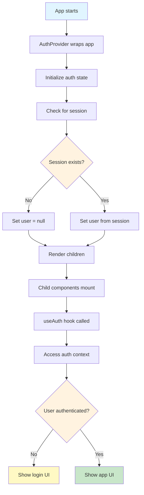

**Context Implementation:**
```typescript
// contexts/AuthContext.tsx
interface AuthContextType {
  user: User | null;
  session: Session | null;
  signIn: () => Promise<void>;
  signOut: () => Promise<void>;
  loading: boolean;
}

export const AuthContext = createContext<AuthContextType | undefined>(undefined);

export function AuthProvider({ children }: { children: ReactNode }) {
  const [user, setUser] = useState<User | null>(null);
  const [session, setSession] = useState<Session | null>(null);
  const [loading, setLoading] = useState(true);
  
  useEffect(() => {
    // Get initial session
    supabase.auth.getSession().then(({ data: { session } }) => {
      setSession(session);
      setUser(session?.user ?? null);
      setLoading(false);
    });
    
    // Listen for changes
    const { data: { subscription } } = supabase.auth.onAuthStateChange(
      (event, session) => {
        setSession(session);
        setUser(session?.user ?? null);
      }
    );
    
    return () => subscription.unsubscribe();
  }, []);
  
  const signIn = async () => {
    await supabase.auth.signInWithOAuth({ provider: 'google' });
  };
  
  const signOut = async () => {
    await supabase.auth.signOut();
  };
  
  return (
    <AuthContext.Provider value={{ user, session, signIn, signOut, loading }}>
      {children}
    </AuthContext.Provider>
  );
}

// Custom hook
export function useAuth() {
  const context = useContext(AuthContext);
  if (!context) {
    throw new Error('useAuth must be used within AuthProvider');
  }
  return context;
}
```

---

## Performance Optimization

### 7.1 Query Optimization Flow

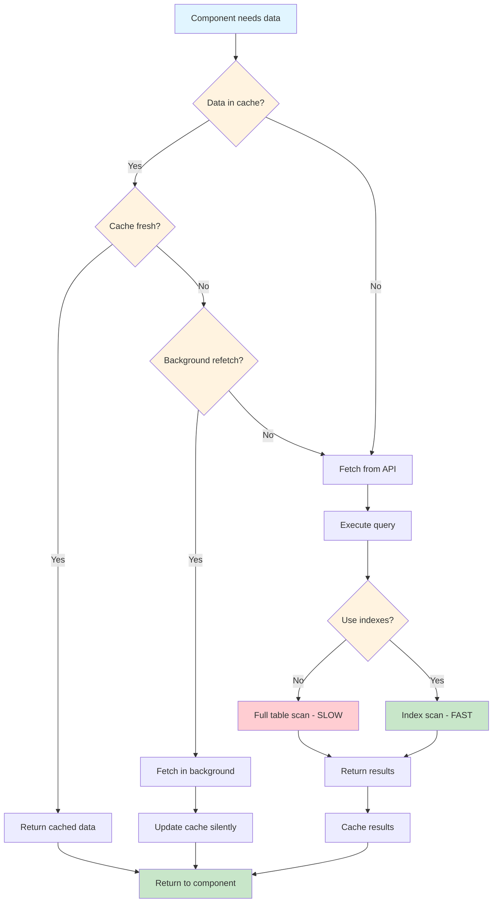

**Database Indexes:**
```sql
-- Index for post queries
CREATE INDEX idx_posts_created_at ON posts(created_at DESC);
CREATE INDEX idx_posts_user_id ON posts(user_id);

-- Index for connections
CREATE INDEX idx_connections_requester ON connections(requester_id);
CREATE INDEX idx_connections_recipient ON connections(recipient_id);
CREATE INDEX idx_connections_status ON connections(status);

-- Composite index for messages
CREATE INDEX idx_messages_conversation_created 
ON messages(conversation_id, created_at DESC);

-- Index for search
CREATE INDEX idx_profiles_search ON profiles 
USING gin(to_tsvector('english', full_name || ' ' || bio));
```

---

### 7.2 Component Rendering Optimization

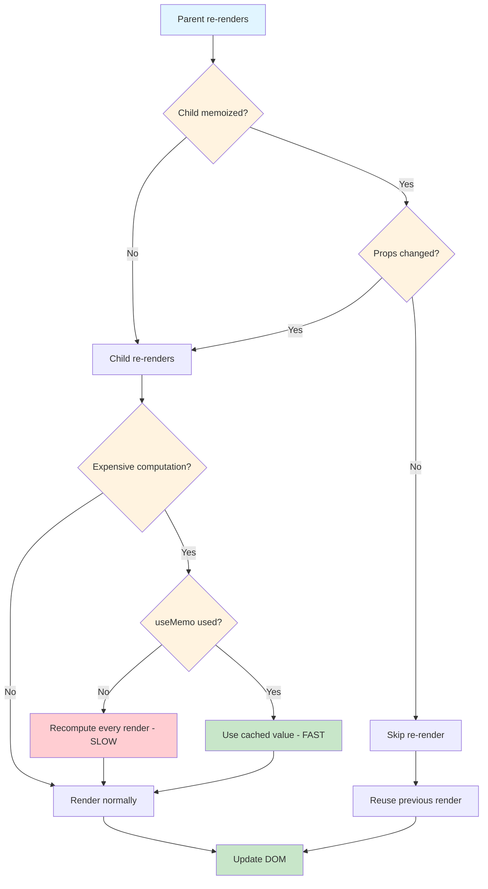

**Optimization Techniques:**
```typescript
// 1. Memoize expensive components
const PostCard = memo(({ post }: { post: Post }) => {
  return (
    <div className="post-card">
      {/* Post content */}
    </div>
  );
});

// 2. Memoize expensive computations
function PostList({ posts }: { posts: Post[] }) {
  const sortedPosts = useMemo(() => {
    return posts.sort((a, b) => 
      new Date(b.created_at).getTime() - new Date(a.created_at).getTime()
    );
  }, [posts]);
  
  return (
    <div>
      {sortedPosts.map(post => (
        <PostCard key={post.id} post={post} />
      ))}
    </div>
  );
}

// 3. Memoize callbacks
function Feed() {
  const handleLike = useCallback((postId: string) => {
    toggleLike(postId);
  }, []);
  
  return <PostList onLike={handleLike} />;
}

// 4. Virtual scrolling for long lists
import { useVirtualizer } from '@tanstack/react-virtual';

function VirtualPostList({ posts }: { posts: Post[] }) {
  const parentRef = useRef<HTMLDivElement>(null);
  
  const virtualizer = useVirtualizer({
    count: posts.length,
    getScrollElement: () => parentRef.current,
    estimateSize: () => 200, // Estimated post height
  });
  
  return (
    <div ref={parentRef} style={{ height: '600px', overflow: 'auto' }}>
      <div style={{ height: `${virtualizer.getTotalSize()}px` }}>
        {virtualizer.getVirtualItems().map(virtualItem => (
          <div
            key={virtualItem.key}
            style={{
              position: 'absolute',
              top: 0,
              left: 0,
              width: '100%',
              transform: `translateY(${virtualItem.start}px)`,
            }}
          >
            <PostCard post={posts[virtualItem.index]} />
          </div>
        ))}
      </div>
    </div>
  );
}
```

---

## Summary

This technical workflow documentation covers:

✅ **Authentication** - Complete OAuth flow, session management, RLS  
✅ **Data Flow** - React Query patterns, optimistic updates  
✅ **API Lifecycle** - Request flow, error handling  
✅ **Real-time** - WebSocket subscriptions, message delivery  
✅ **File Upload** - Storage flow, validation, RLS policies  
✅ **State Management** - Context providers, custom hooks  
✅ **Performance** - Query optimization, rendering optimization

**Related Documentation:**
- [Workflows](./WORKFLOWS.md) - User-facing workflows
- [Architecture](./ARCHITECTURE.md) - System architecture
- [API Documentation](./API_DOCUMENTATION.md) - API reference
