# Workflow Documentation - First Responder Connect

Complete workflow diagrams and process flows for all features in the Paranet platform.

**Last Updated:** January 24, 2026  
**Version:** 1.0

---

## Table of Contents

1. [Overview](#overview)
2. [User Workflows](#user-workflows)
3. [Technical Workflows](#technical-workflows)
4. [Admin Workflows](#admin-workflows)
5. [Organization Workflows](#organization-workflows)
6. [Error Handling](#error-handling)
7. [State Management](#state-management)

---

## Overview

This document provides comprehensive workflow diagrams for all features in the First Responder Connect platform. Each workflow includes:

- **Visual flowcharts** using Mermaid diagrams
- **Step-by-step process descriptions**
- **Technical implementation details**
- **Error handling scenarios**
- **Success/failure paths**

### Diagram Legend

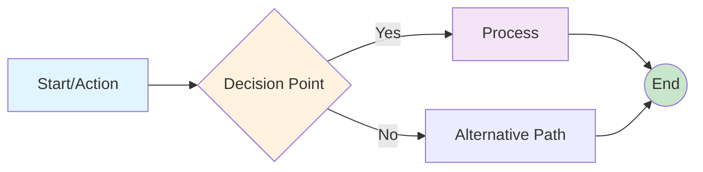

**Colors:**
- 🔵 Blue: Start/User Actions
- 🟡 Yellow: Decision Points
- 🟣 Purple: System Processes
- 🟢 Green: Success/End States
- 🔴 Red: Error States

---

## User Workflows

### 1. Authentication & Onboarding

#### 1.1 User Sign Up Flow

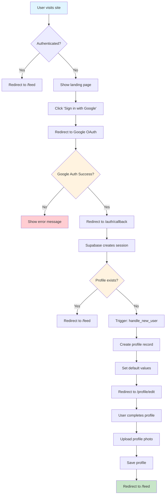

**Steps:**

1. **Landing Page** - User arrives at site
2. **Authentication Check** - Check if user has active session
3. **Google OAuth** - Redirect to Google for authentication
4. **Callback Handling** - Process OAuth callback
5. **Session Creation** - Supabase creates user session
6. **Profile Check** - Check if profile exists in database
7. **Profile Creation** - Trigger creates new profile (if needed)
8. **Profile Completion** - User fills out profile details
9. **Photo Upload** - User uploads profile photo to storage
10. **Redirect to Feed** - User enters main application

**Technical Details:**
- **Auth Provider:** Supabase Auth with Google OAuth
- **Trigger:** `handle_new_user()` on `auth.users` insert
- **Storage:** Profile photos in `profile-media` bucket
- **RLS:** User can only edit their own profile

---

#### 1.2 Profile Completion Flow

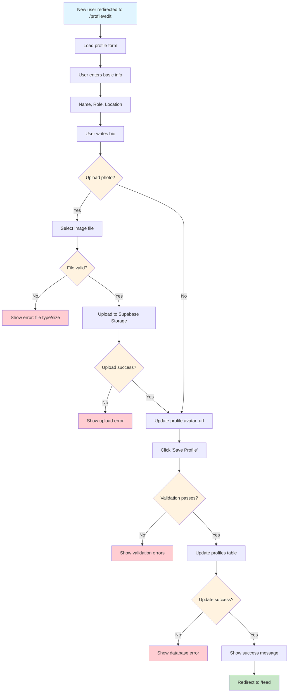

**Validation Rules:**
- Name: Required, 2-100 characters
- Role: Required, must be valid role enum
- Location: Optional, max 200 characters
- Bio: Optional, max 500 characters
- Avatar: Max 5MB, image types only (jpg, png, webp)

---

### 2. Social Feed Workflows

#### 2.1 Create Post Flow

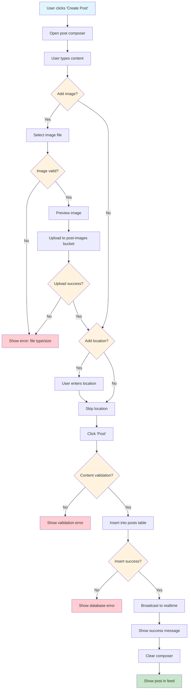

**Technical Implementation:**

```typescript
// Post creation service
async function createPost(data: CreatePostData) {
  // 1. Validate content
  if (!data.content || data.content.length > 5000) {
    throw new Error('Invalid content length');
  }
  
  // 2. Upload image if provided
  let imageUrl = null;
  if (data.image) {
    imageUrl = await uploadPostImage(data.image);
  }
  
  // 3. Insert post
  const { data: post, error } = await supabase
    .from('posts')
    .insert({
      user_id: currentUser.id,
      content: data.content,
      image_url: imageUrl,
      location: data.location,
    })
    .select()
    .single();
    
  if (error) throw error;
  
  // 4. Broadcast to realtime subscribers
  return post;
}
```

**Validation Rules:**
- Content: Required, 1-5000 characters
- Image: Optional, max 10MB, image types only
- Location: Optional, max 200 characters

---

#### 2.2 Like Post Flow

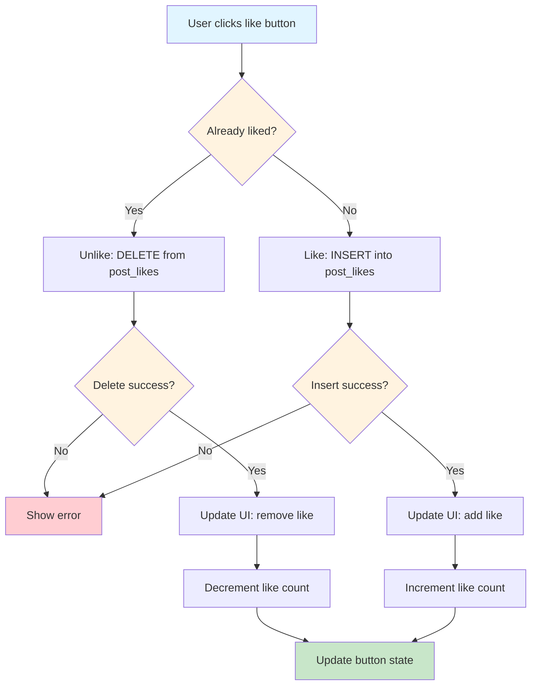

**Optimistic UI Update:**
```typescript
async function toggleLike(postId: string) {
  const isLiked = checkIfLiked(postId);
  
  // Optimistic update
  updateUIImmediately(!isLiked);
  
  try {
    if (isLiked) {
      await supabase
        .from('post_likes')
        .delete()
        .match({ post_id: postId, user_id: currentUser.id });
    } else {
      await supabase
        .from('post_likes')
        .insert({ post_id: postId, user_id: currentUser.id });
    }
  } catch (error) {
    // Revert on error
    updateUIImmediately(isLiked);
    showError('Failed to update like');
  }
}
```

---

#### 2.3 Comment on Post Flow

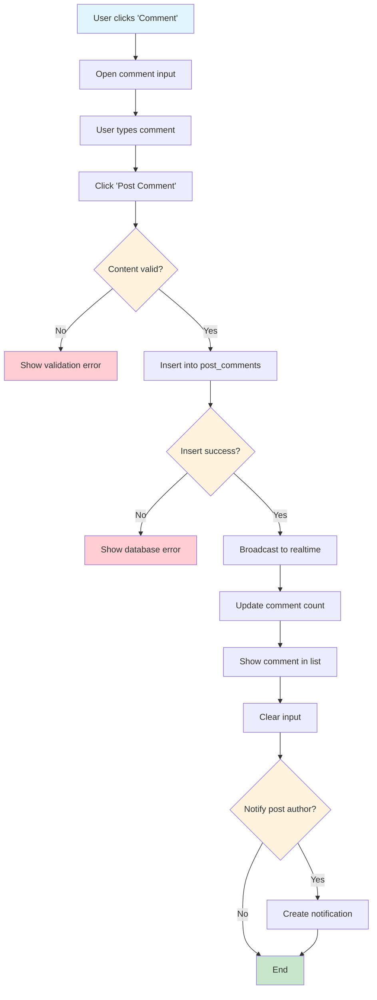

**Notification Logic:**
- Create notification if commenter ≠ post author
- Notification type: `comment`
- Links to post with comment highlighted

---

### 3. Connection Workflows

#### 3.1 Send Connection Request Flow

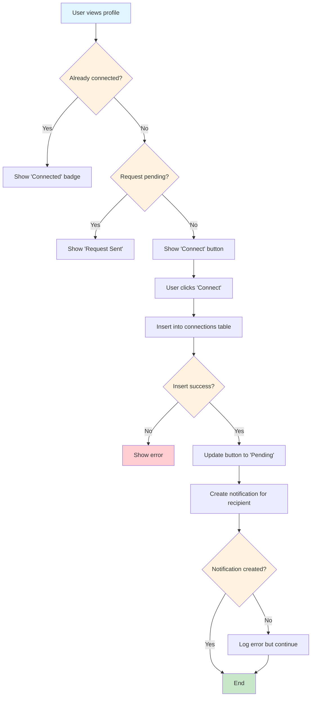

**Database Schema:**
```sql
-- connections table
CREATE TABLE connections (
  id UUID PRIMARY KEY DEFAULT uuid_generate_v4(),
  requester_id UUID REFERENCES profiles(id),
  recipient_id UUID REFERENCES profiles(id),
  status TEXT CHECK (status IN ('pending', 'accepted', 'rejected')),
  created_at TIMESTAMPTZ DEFAULT NOW(),
  updated_at TIMESTAMPTZ DEFAULT NOW(),
  UNIQUE(requester_id, recipient_id)
);
```

---

#### 3.2 Accept/Reject Connection Request Flow

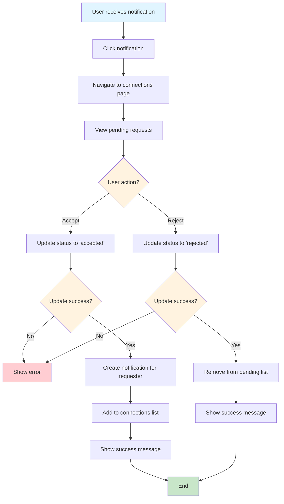

**Mutual Connection Check:**
```typescript
async function getMutualConnections(userId: string, otherUserId: string) {
  const { data } = await supabase.rpc('get_mutual_connections', {
    user_id_1: userId,
    user_id_2: otherUserId
  });
  return data;
}
```

---

### 4. Direct Messaging Workflows

#### 4.1 Start Conversation Flow

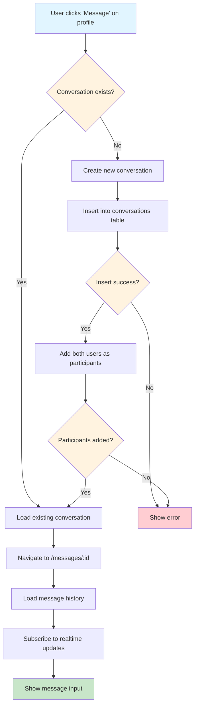

---

#### 4.2 Send Message Flow

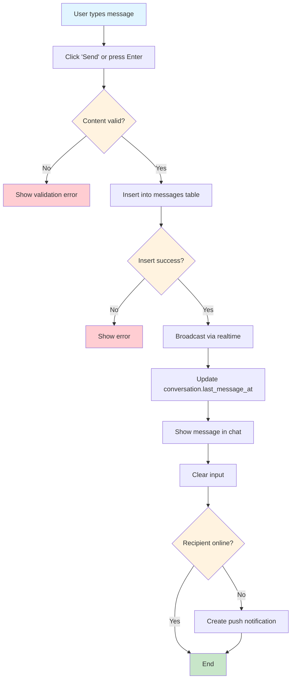

**Realtime Subscription:**
```typescript
// Subscribe to new messages
const subscription = supabase
  .channel(`conversation:${conversationId}`)
  .on('postgres_changes', {
    event: 'INSERT',
    schema: 'public',
    table: 'messages',
    filter: `conversation_id=eq.${conversationId}`
  }, (payload) => {
    addMessageToUI(payload.new);
  })
  .subscribe();
```

---

#### 4.3 Read Receipt Flow

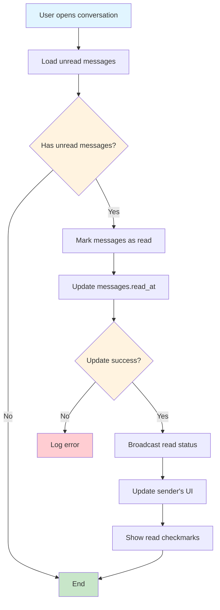

---

### 5. Job Board Workflows

#### 5.1 Browse Jobs Flow

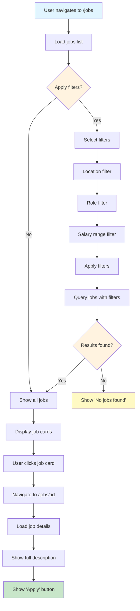

**Filter Query:**
```typescript
let query = supabase
  .from('jobs')
  .select('*, organization:organizations(name, logo_url)')
  .eq('status', 'active')
  .order('created_at', { ascending: false });

if (filters.location) {
  query = query.ilike('location', `%${filters.location}%`);
}
if (filters.role) {
  query = query.eq('role', filters.role);
}
if (filters.minSalary) {
  query = query.gte('salary_min', filters.minSalary);
}

const { data: jobs } = await query;
```

---

#### 5.2 Apply to Job Flow

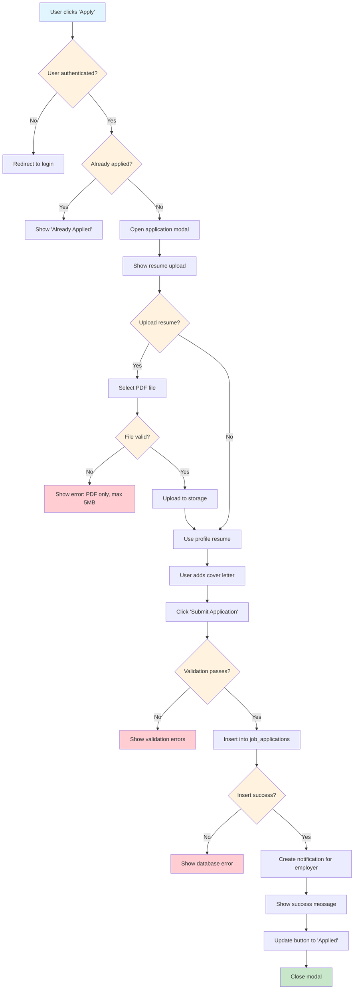

**Application Data:**
```typescript
interface JobApplication {
  id: string;
  job_id: string;
  user_id: string;
  resume_url: string;
  cover_letter?: string;
  status: 'pending' | 'reviewed' | 'accepted' | 'rejected';
  created_at: string;
}
```

---

### 6. Credential Management Workflows

#### 6.1 Add Credential Flow

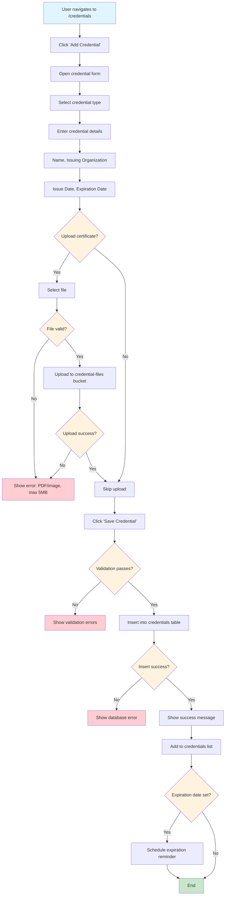

**Expiration Reminder Logic:**
```typescript
// Check for expiring credentials (run daily)
async function checkExpiringCredentials() {
  const thirtyDaysFromNow = new Date();
  thirtyDaysFromNow.setDate(thirtyDaysFromNow.getDate() + 30);
  
  const { data: expiring } = await supabase
    .from('credentials')
    .select('*, user:profiles(email, full_name)')
    .lte('expiration_date', thirtyDaysFromNow.toISOString())
    .gte('expiration_date', new Date().toISOString())
    .is('reminder_sent', false);
    
  for (const credential of expiring) {
    await sendExpirationEmail(credential);
    await supabase
      .from('credentials')
      .update({ reminder_sent: true })
      .eq('id', credential.id);
  }
}
```

---

#### 6.2 Share Credential Showcase Flow

```mermaid
flowchart TD
    A[User navigates to /credentials] --> B[Click 'Share Showcase']
    B --> C[Generate unique showcase URL]
    C --> D[/showcase/:userId]
    D --> E[Copy URL to clipboard]
    E --> F[Show success message]
    F --> G{User shares URL?}
    G -->|Yes| H[Recipient opens URL]
    G -->|No| I[End]
    H --> J[Load public showcase page]
    J --> K[Query user's public credentials]
    K --> L{Credentials found?}
    L -->|No| M[Show 'No credentials']
    L -->|Yes| N[Display credential cards]
    N --> O[Show user info header]
    O --> P[Show credential details]
    P --> Q{Certificate available?}
    Q -->|Yes| R[Show 'View Certificate' button]
    Q -->|No| S[End]
    R --> S
    I --> S
    
    style A fill:#e1f5ff
    style G fill:#fff3e0
    style L fill:#fff3e0
    style Q fill:#fff3e0
    style S fill:#c8e6c9
```

**Public Showcase Query:**
```typescript
// Only show credentials marked as public
const { data: credentials } = await supabase
  .from('credentials')
  .select('*')
  .eq('user_id', userId)
  .eq('is_public', true)
  .order('issue_date', { ascending: false });
```

---

## Summary

This workflow documentation covers the main user-facing features. Each workflow includes:

✅ Visual flowchart with decision points  
✅ Step-by-step process description  
✅ Technical implementation details  
✅ Error handling scenarios  
✅ Database queries and code examples

**Next Sections:**
- Technical Workflows (authentication, data flow, API)
- Admin Workflows (moderation, user management)
- Organization Workflows (agency management, subscriptions)
- Error Handling (comprehensive error scenarios)
- State Management (React context, caching)

---

**Related Documentation:**
- [Architecture](./ARCHITECTURE.md) - Technical architecture
- [API Documentation](./API_DOCUMENTATION.md) - API reference
- [Implementation Guide](./IMPLEMENTATION_GUIDE.md) - Development guide
